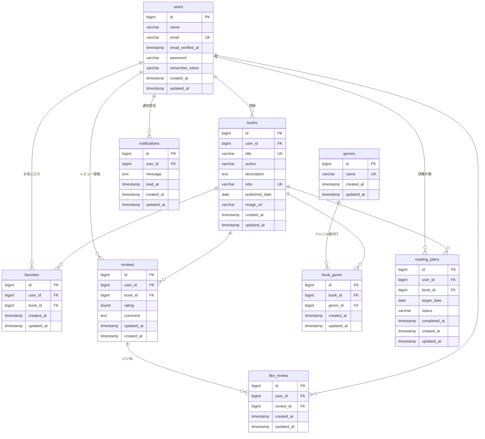

# BookShelf 書籍レビュー・読書管理アプリ

## 概要
本プロジェクトは、書籍の登録・検索からレビュー投稿、日々の読書計画の進捗管理までを統合して行えるWebアプリケーションです。
Traditional Web（Blade + セッション認証）のアーキテクチャをベースに設計しつつ、外部アプリケーションとの連携を想定した公開API（Sanctumによるトークン認証付き）も提供しています。Google Books APIを利用したISBNからの書籍情報自動取得機能や、スケジュールタスクによる読書計画の自動状態更新・リマインダー通知機能など、実用的な機能を備えています。

## 使用技術
- **PHP**: 8.5
- **Framework**: Laravel 10.x
- **Database**: MySQL 8.4
- **Frontend**: Vite, Tailwind CSS ^3.4.0, Alpine.js
- **Environment**: Docker, Laravel Sail
- **Testing**: PHPUnit (カバレッジ目標 Lines 80%以上)
- **Code Quality**: Laravel Pint (PSR-12準拠)

## 開発環境URL
- Webアプリケーション: http://localhost
- phpMyAdmin: http://localhost:8080

---

## ER図


---

## APIエンドポイント一覧
外部アプリケーション向けに、書籍リソースを操作するJSONベースのREST APIを提供しています。書き込み系エンドポイントはLaravel Sanctumによる認証・認可制御を行っています。

| メソッド | エンドポイント | 概要 | 正常時ステータス | 異常時ステータス |
| --- | --- | --- | --- | --- |
| **GET** | `/api/v1/books` | 書籍一覧の取得 | `200 OK` | - |
| **GET** | `/api/v1/books/{book}` | 指定した書籍の詳細取得 | `200 OK` | `404 Not Found` |
| **POST** | `/api/v1/books` | 新規書籍の登録 (要認証) | `201 Created` | `422 Unprocessable Entity`<br>`401 Unauthorized` |
| **PUT** | `/api/v1/books/{book}` | 書籍情報の更新 (要認証・認可) | `200 OK` | `422 Unprocessable Entity`<br>`404 Not Found`<br>`401 Unauthorized`<br>`403 Forbidden` |
| **DELETE** | `/api/v1/books/{book}` | 書籍の削除 (要認証・認可) | `204 No Content` | `404 Not Found`<br>`401 Unauthorized`<br>`403 Forbidden` |

---

## 環境構築手順

以下の手順に従って、採点用・開発用のローカル環境を構築してください。本プロジェクトは `Laravel 10.x` を明示的に指定して構築しています。

### 1. リポジトリのクローンと移動
```bash
# プロジェクトをクローンし、ディレクトリに移動します
git clone https://github.com/hana20210115/bookshelf-test.git bookshelf-app
cd bookshelf-app
```

### 2. Laravel Sailのインストール
次に、以下のコマンドを1つずつコピーして実行してください。
```bash
# 1. Laravel Sail（開発環境構築ツール）をインストール
docker run --rm -u "$(id -u):$(id -g)" -v "$(pwd):/var/www/html" -w /var/www/html -e COMPOSER_CACHE_DIR=/tmp/composer_cache laravelsail/php82-composer:latest composer require laravel/sail --dev

# 2. Sailの設定ファイルをパブリッシュ（MySQLを選択）
docker run --rm -u "$(id -u):$(id -g)" -v "$(pwd):/var/www/html" -w /var/www/html -e COMPOSER_CACHE_DIR=/tmp/composer_cache laravelsail/php82-composer:latest php artisan sail:install --with=mysql
```
**※M1/M2/M3 Macをお使いの方へ**
`sail up -d` 実行時に `no matching manifest for linux/arm64/v8` エラーが発生した場合、`compose.yaml` の `mysql` サービスに `platform: 'linux/amd64'` を追加してください。

### 3. 環境変数の設定 (.env の作成)
```bash
# 環境変数のベースファイルをコピーして .env を作成します
cp .env.example .env
```
作成された `.env` ファイルを開き、データベース接続情報を Laravel Sail 環境に合わせて以下のように**書き換えて**ください。
```env
DB_CONNECTION=mysql
DB_HOST=mysql
DB_PORT=3306
DB_DATABASE=laravel
DB_USERNAME=sail
DB_PASSWORD=password
```
※ `compose.yaml` の設定（phpMyAdmin等の追加記述）は既に構築済みの状態でコミットされているため、ファイルの編集は不要です。

### 4. コンテナの起動とエイリアス設定
各コマンドを1行ずつ順番に実行してください。

```bash
# 1. コンテナをバックグラウンドで起動
./vendor/bin/sail up -d

# 2. エイリアス（ショートカット）を設定
echo "alias sail='[ -f sail ] && bash sail || bash vendor/bin/sail'" >> ~/.zshrc
# ※ Windows (WSL) 環境の場合は代わりに以下を実行してください
# echo "alias sail='[ -f sail ] && bash sail || bash vendor/bin/sail'" >> ~/.bashrc

# 3. シェル設定の反映
exec $SHELL
```

### 5. パッケージのインストール
本プロジェクトに必要な依存パッケージ（Tailwind CSS, Alpine.js等のフロントエンド環境を含む）および設定ファイルは、すべてリポジトリにコミット済みです。
以下のコマンドを実行して、パッケージを一括インストールしてください。

```bash
# 1. PHPの依存パッケージをインストール
sail composer install

# 2. フロントエンドのパッケージをインストール
sail npm install
```
※ `tailwind.config.js` 等の生成や上書き作業は不要です。

### 6. Google Books API キーの取得・設定
書籍の自動検索機能を使用するため、Google Books APIキーを設定します。

1. [Google Cloud Console](https://console.cloud.google.com/) にアクセスし、Googleアカウントでログインします。
2. 上部メニューから「プロジェクトの選択」＞「新しいプロジェクト」をクリックし、プロジェクトを作成します。
3. 左側メニューの「APIとサービス」＞「ライブラリ」を選択します。
4. 検索窓で「Books API」と検索し、選択して「有効にする」をクリックします。
5. 「APIとサービス」＞「認証情報」へ移動し、「認証情報を作成」＞「APIキー」を選択します。
6. 生成されたAPIキーをコピーし、`.env` ファイルの末尾に以下のように追加してください。
```env
GOOGLE_BOOKS_API_KEY=取得したAPIキーをここに貼り付け
```

### 7. アプリケーションの初期化とサーバー起動
以下のコマンドでアプリケーションキーの生成、テストデータの流し込み、およびフロントエンドのビルドを行います。
```bash
sail artisan key:generate
sail artisan migrate --seed
sail npm run build
```

**※ テストデータ（Seeder）の工夫について**
上記の `sail artisan migrate --seed` コマンドにより、採点時の動作確認がスムーズに行えるよう、実務を想定したダミーデータが自動生成されます。
- **BookSeeder**: マイ読書レポートで複数ユーザーの所有書籍が確認できるよう、登録者をランダムユーザーに割り当てています。
- **ReviewSeeder**: 評価分布グラフが意味のある分布になるよう1〜5段階を網羅し、汎用的な日本語テンプレートコメントを設定。各書籍に2〜4件のレビューをランダムユーザーで生成します。
- **ReadingPlanSeeder**: 読書計画の各種挙動（発火する/しないパターン）を網羅的に確認できるよう、`Carbon::today()` を起点とした相対日付（`in_progress`、`completed`、`overdue`）でレコードを作成。採点日が変わっても同じシナリオが再現されます。また、認可判定テスト用に複数ユーザーへ分散させつつ、主要な確認シナリオはメインテストユーザーに集約させています。

**※ 認証機能（Laravel Fortify）の設定について**
本プロジェクトの認証機能（会員登録・ログイン等）は、ライブラリ `Laravel Fortify` を用いて実装しています。
関連する設定ファイル（`config/fortify.php`）やサービスプロバイダの登録はリポジトリにコミット済みのため、上記手順のパッケージインストールおよびマイグレーションの実行により、自動的に利用可能な状態となります。（追加での `vendor:publish` 等の実行は不要です）

**※ 日本語化に関する注意事項**
バリデーション等の日本語化は `config/app.php` の locale を `ja` に変更し、`lang/ja/` への手動配置にて行っています。セキュリティ要件（サプライチェーン攻撃への対策）に基づき、`laravel-lang/*` 系パッケージは導入しないでください。

---

## 主な画面URL一覧

環境構築後、以下のURLにアクセスして各機能の動作をご確認いただけます。

| 画面名 | URL |
| --- | --- |
| **書籍一覧画面（トップ画面）** | http://localhost/books |
| **会員登録画面** | http://localhost/register |
| **ログイン画面** | http://localhost/login |
| **書籍登録画面** | http://localhost/books/create |
| **マイ読書レポート** | http://localhost/reports |
| **読書計画一覧** | http://localhost/reading-plans |
| **通知一覧** | http://localhost/notifications |

### 動作確認用テストアカウント（Seeder生成データ）
マイグレーション（`--seed`）実行時に自動作成されるテスト用ユーザー情報を用いてログインできます。読書計画の通知や期限切れなどの主要なテストシナリオは、以下のメインテストユーザー（山田太郎）に集約されています。
- **メールアドレス**: `yamada@example.com`
- **パスワード**: `password`

---

## テストの実行とカバレッジ確認【採点者様へ】

採点時の動作確認、コードカバレッジの計測、およびコード品質等の確認には、以下のコマンドを使用してください。

### 1. テストの実行
本プロジェクト内に記述された全ての単体テスト（Unit）および機能テスト（Feature）を実行し、要件定義の挙動を満たしているか確認します。
```bash
sail artisan test
```

### 2. テストカバレッジの確認
応用機能を含めたアプリケーション全体におけるテスト網羅率（カバレッジ）を計測します。要件である **Lines（行カバレッジ）80%以上** を満たしていることをコンソール上で確認できます。
```bash
sail artisan test --coverage
```
※ もし上記コマンドで詳細が出力されない場合は、以下のコマンドを使用してください。
```bash
XDEBUG_MODE=coverage sail bin phpunit --coverage-text
```

### 3. コードフォーマット（コード品質）の確認
本プロジェクトはLaravel Pintを用いてPSR-12に準拠したコーディング規約を徹底しています。以下のコマンドを実行することで、コードにスタイル違反がないこと（PASS状態であること）をご確認いただけます。
```bash
sail bin pint --test
```

### 4. 日次バッチ処理（スケジュールタスク）の手動実行
読書計画の自動更新機能の手動確認として、日次バッチ処理を即時実行する場合は以下のコマンドを使用してください。
```bash
sail artisan batch:reading-plans
```
※ コマンド実行後、データベースの `reading_plans` テーブルのステータス更新、および `notifications` テーブルへの通知レコード作成をご確認いただけます。